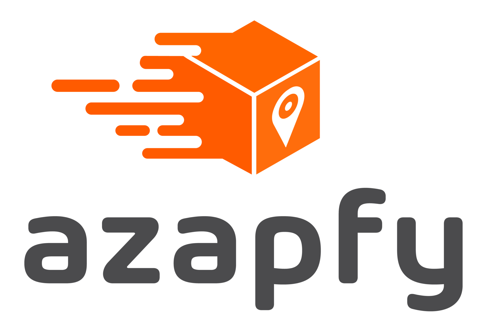

<p align="center"></p>


## REST API Azapfy

Aplicação com objetivo de recuperar os dados de uma api, realizar os possíveis cálculos e retorna os resultados obtidos agrupando eles por remetente. 

- Agrupa as notas por remetente.
- Calcula o valor total das notas para cada remetente.
- Calcula o valor que o remetente irá receber pelo que já foi entregue.
- Calcula o valor que o remetente irá receber pelo que ainda não foi entregue.
- Calcula quanto o remetente deixou de receber devido ao atraso na entrega.


### Tecnologias utilizadas

* [Docker](https://www.docker.com/)
* [NGINX](https://www.nginx.com/)
* [PHP 8.2](https://www.php.net/releases/8.2/en.php)
* [Laravel 10](https://laravel.com/docs/10.x)

### Comandos para iniciar o projeto

```bash
$ docker-compose up -d --build

$ docker-compose exec app bash

# executar dentro do container da aplicação

$ cp .env.example .env

$ composer install

$ php artisan key:generate

$ chown www:www -R storage/

```

### Collection Postman
- [Rotas]()
